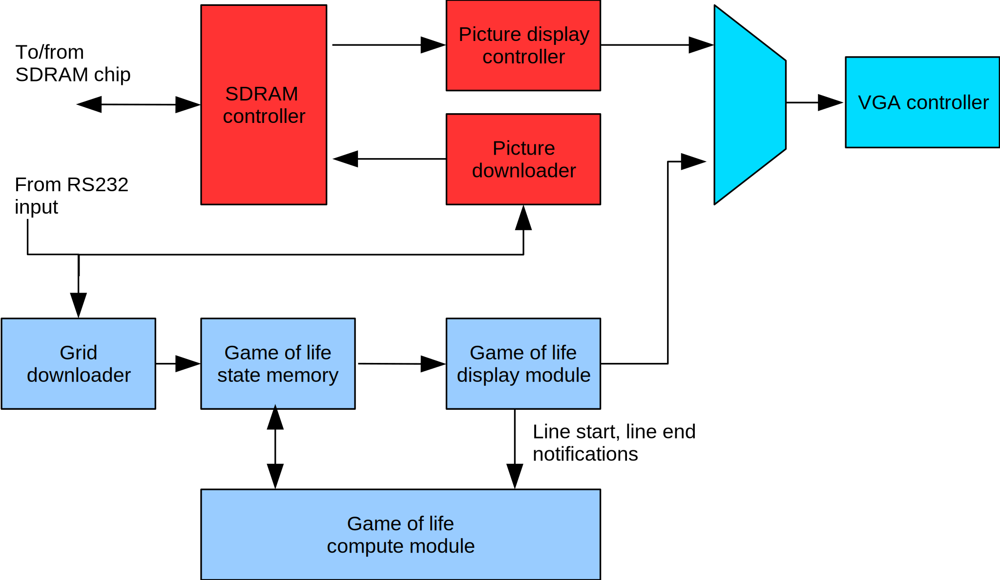

======================
Game of Life on FPGA4U
======================

In this project, we implement the game of life on the `FPGA4U
<http://fpga4u.epfl.ch>`__. The final result features a high-resolution VGA
controller, an RS232 UART, and an SDRAM controller. It allows uploading game of
life patterns and eight-color high resolution images. It is possible to run the
game step by step or in continuous mode. The VHDL design is entirely
configurable: baud rate, VGA resolution, and grid size are customizable. The
project uses two different PLLs for the VGA controller and the SDRAM to allow
high screen refresh rates without being limited by the SDRAM speed.

This project was originally done in spring semester 2007 at the Logic Systems
Laboratory, EPFL (Lausanne) under the supervision of Prof. Eduardo Sanchez.

.. image:: images/picm.jpg

Introduction
============

Two kinds of FPGAs were available for this project:

- Cyclone 2 EP2C20F484C8N
- EP20K200EFC484-2X

The first one is used by the FPGA4U board, which can be connected to a computer
via the USB port. The second board is older and can be connected
via the parallel port.

At the beginning of the project, we tried to develop the project on both of
them. Then we decided to concentrate on the `FPGA4U <http://fpga4u.epfl.ch>`__. This
board has large internal memories that can be accessed in one clock cycle. They
can also be initialized from the Quartus IDE, which helps with testing.

Our project fulfills following criteria:

- **Flexibility**: the use of generics is allows configuring different
  paramaters of the game, such as the number of cells in a row or column, the
  size of the uploaded images, etc. This avoids the need of modifying the
  parameters in the source code and allows fast testing in various
  configurations.

- **Scalability**: the design accommodates any resolution provided that memory
  and chip speed are suitable.

- **Speed**: one cell is updated per clock cycle, which allows as many images
  per second as the refresh rate of the VGA controller allows.


The Game of Life
================

The game of life is a cellular automaton. It is a two dimensional grid that may
be theoretically infinite. In practice, it has a finite width and height and can
form a torus. Each cell of the grid has two distinct states: dead or alive.

The rules to determine the new state of a cell given the state of the neighbours
are the following:

- If a cell is dead but has three alive cells around it, it gets alive at the
  next step.

- If a cell is alive, it stays alive at the next step only if it has two or
  three alive cells around it.

- If a cell is surrounded by zero or one live cell, it will be dead at the next
  step (death by isolation).

- If a cell is surrounded by more than three live cells, it will be dead at the
  next step (death by over population).


System Layout
=============

The system displays a background 8-color image and overlays the game of life
grid on top of that image. Both the grid and the image can be uploaded through
an UART port. The system is composed of the following components.

- The VGA controller (vga.vhd)
- The SDRAM controller which stores the uploaded image (``sdram.vhd``)
- The background picture module, display and download (``sdram_picture.vhd``)
- The grid downloader (``file_downloader.vhd``)
- The grid display module (``gol2_grid.vhd``)
- The grid compute module (``gol2_compute.vhd``)

The diagram below shows the overall system organization. The
design of each part will be discussed in the following sections.



There are two distinct blocks in the system. The first block is responsible for
handling the background image stored in SDRAM (upper part of the diagram),
while the second block takes care of the game of life (lower part). The
multiplexer before the VGA controller selects the right color to display: if
the grid has an empty cell, the background image is selected, otherwise the
color corresponding to the filled cell is taken.

Display Subsystem Layout
========================

VGA Controller
--------------

The VGA controller interfaces the FPGA with an external VGA monitor. It
provides a 1-bit output for each primary color (read, green, blue), allowing it
to display 8 colors. This requires a simple daughter board with one diode per
color in order to generate the correct voltage (0.7V) for the monitor. The
vertical and horizontal sync signals can be connected directly to the monitor.

The VGA controller interfaces with the rest of the design as follows. It
provides the coordinates of the row and column to be displayed and expects to
get the corresponding color data on the next cycle. We decided to use a one
cycle delay because it is exactly the delay of the on-chip memory. The
controller also generates horizontal and vertical refresh signals. These
signals are used by the image and game of life display modules to synchronize
their operations.

SDRAM Controller
----------------

This controller provides an interface to the SDRAM chip on the FPGA4U. The chip
is an ISSI 42S32800B with 2M words * 32 bits * 4 banks. Each bank is organized
in 4096 rows of 512 32-bit columns. Our implementation supports full page burst
reads and writes. Refreshes are also handled. The maximum clock speed that the
FPGA supports is 96 MHz. Above this limit, the SDRAM returns corrupted data.

The problem with our initial single-clock implementation was that a low speed
limited the refresh rate of the VGA controller. To solve this issue, we used a
separate clock for the SDRAM controller, running at a slower speed. This raises
a synchronization issue between different clock domains. We shall explain the
solution in the following sections.

Image Display Controller
------------------------

Each row of the bank zero of the SDRAM contains the corresponding row of the
image. Each column contains 8 pixels (8 * 4bpp). Pixels are aligned on a 4 bit
boundary to simplify handling, even if only 3 bits are used for the color.
Thus, the maximum size of a screen row is limited by the number of columns of
the SDRAM. Our implementation supports images of up to 4096 pixels wide, which
is enough considering the typical resolution of today's monitors.

The image display controller uses the full-page burst capability of the SDRAM
controller. It reads an entire row of the image in one operation during the
horizontal refresh right before the VGA controller is about to display it. For
example, if the VGA controller has just finished displaying row 5, the image
display controller will preload row 6 during the horizontal refresh at the end
of row 5. Likewise, the first row of the picture is preloaded when the last one
is finished, that is during the vertical refresh.

The image controller stores each row in the on-chip memory of the FPGA so that
it is ready to be read by the VGA controller. This intermediate memory is a
dual-port dual-clock memory: it can be accessed independently by modules
located in different clock domains. The VGA controller provides its clock and
address on input A and reads output on port A. The image controller loads the
data on port B, and provides its own clock, which is shared with the SDRAM
controller and the image downloader.

When the FPGA is turned on, the SDRAM is initialized with an initial background
pattern. It is necessary to provide a means of uploading different images. We
achieve this by using an RS232 UART controller. The image downloader has its
own on-chip dual-port memory block whose size corresponds to the size of a row
(e.g., 1024 pixels or 4Kbits). It constantly polls the ready signal of the
UART. When 4 bytes are read, the word is written to this memory. When the whole
line has been read, the controller signals to the image display controller that
it can copy this line to the SDRAM. The image controller then inserts a write
burst on the next horizontal refresh, just after it has read the next line to
be displayed (displayed data has priority over uploaded data). It also must be
ready to write the available line during the vertical refresh to avoid data
loss (the vertical refresh has a long delay).

The current implementation works up to 921600 baud per second. This limit is
set by the MAX232 chip used to convert RS232 signals. Considering the high baud
rate, it is necessary to compute maximum delays to avoid losing incoming bytes.
At 96 Mhz, 921600 bps, 1 start bit, 1 stop bit, 8 data bits and 1 parity (11
bits), each byte is received after a ``96MHz/921600*11=1154`` clock cycles. A
word is ready every 4616 cycles. This means that the image display controller
has to begin the copy to SDRAM no later than 4616 cycles after the last byte is
received otherwise data loss occurs (the buffer is overwritten with new data).
This is enough, considering that each line has 1280 pixels and 408 horizontal
refresh cycles. To avoid slowing down operations, we have chosen a dual port
memory block for the download buffer. It can be easily shared between the
display and the download module.

Game-of-Life Subsystem Layout
=============================

This section describes the different modules composing the game of life
subsystem as well as their interactions.

The subsystem is comprised of two memory buffers: the first buffer contains
the current state of the grid, while the second one contains the next state.
After the next state is computed, the buffers are switched and the process
repeats again.

The display module sends line information from the first buffer after
the compute module has finished calculating it. The figure below
summarizes the layout.


Display Module
--------------

This module reads the incoming row and column from the VGA controller and gives
back the corresponding color on the next clock cycle. This color is either
transparent or opaque, depending on the state of the current cell.

Cells can be larger than one pixel. In this case, the horizontal retrace signal
does not always correspond to the end of a grid line. The display module keeps
track of the actual grid line and signals to the compute module when the VGA
controller has finished displaying it, so that the new state of the next row
can be computed.

Compute Module
--------------

This module takes the current state of the grid and computes the next state of
each cell. To compute the next state of a cell, we must know the states of the
eight cells surrounding the current cell and also the state of the current
cell. The responsible entity for computing the grid is
``gol2_computegrid.vhd``.

A straightforward solution would issue 9 memory accesses to read the state of
the 8 neighbouring cells and write the result, which takes in total 18
clock cycles. Unfortunately, this solution turned out to be two slow and could
not reach the monitor's refresh rate (i.e., 60-70 grid updates per second).

The optimized solution uses a sliding window comprised of nine flip-flops. Each
flip-flop contains the state of a cell. This sliding buffer covers the whole
grid of the game and is used to compute the state of the current cell. You can
see the buffer in the figure below, each flip-flop contains the state of a
cell. ``CUR`` is the state of the current cell and ``NE``, ``N``, ``NW``,
``W``, ``E``, ``SW``, ``S`` and ``SE`` contain the state of the cells around
the current one.


To compute the state of a line, the buffer moves from the left to the right. At
the beginning of the line, the compute module loads all cell states in the
buffer. Each time the buffer moves one cell to the right, the last column of
the buffer is shifted to the left and we load the next three states needed for
in ``NE``, ``E``, and ``SE``. You can see this process on the diagram below.


Optimizing Memory Accesses
--------------------------

If we use a single port memory, this buffer requires three memory accesses
(four clock cycles to compute the state of the current cell using pipelined
reads). A solution to make this faster is to use a 3-port memory. However, this
kind of memory does not exist in Quartus, so we need to emulate a triple-port
memory by optimizing the grid layout using normal dual-port memories.

We observe that using the buffering technique shown above
requires one read per line at each new step. If we calculate the state of the
cell at line 6 and column 5 we must load the state of the cell at (5,6),
(6,6) and (7,6).

To optimize this, we split the grid across three memory blocks, all of which
can be accessed in parallel. The idea is to have three single port memories,
each 3rd line being stored in a different memory bank, as shown in the figure
below. For example, the state of the cell (3,10) is stored in the memory bank 0.
The column determines the offset inside the memory bank.


The compute module uses a module 3 counter in order to determine which bank to
use for the current cell. This is easier to implement than a combinatorial
module operation. The counter is located in ``gol2_m3counter.vhd```.


With this method an important constraint is that the number of rows must be a
multiple of 3. Let us consider three cells (cellX, cellY, and cellZ) as
depicted in the figure above. When we want to compute the state of ``cellX``
(1,2), we must read the states of the cells located at (0,3), (1,3) and
(2,3). The corresponding banks are 0, 1, and 2. For ``cellY`` (2,5), we must
read cells (1,6), (2,6), and (3,6), their corresponding banks being 1, 2, and
0. For ``cellZ`` (4,8), we have to read (3,9), (4,9), and (5,9), their
corresponding bank being 2, 0, and 1. The problem arises when we want to
compute the state of a cell located at the edges of the grid. If the row count
is not a multiple of three, it would take extra hardware to select the line
from the right bank (remember that the grid is a kind of sphere, without
"edges"). If the line count is a multiple of three, the general case works.


Implementation
--------------

The game-of-life subsystem contains the following state machine:


The state machine is divided in three parts. The first part checks the current
operation mode, i.e., single step or not. If it is single step mode, it waits
for the user to press a button before starting the computation of the grid. The
second part synchronizes itself on the first line. As soon as the first line is
being displayed (after a vertical retrace), the state machine issues a preload
request to the compute line module. It is necessary to know the state of 9
cells before the sliding can begin. Once the preload is done, the state machine
waits for the end of the first row. The last part is a loop, which computes the
rest of the grid. When it is finished, it swaps the memories on the vertical
refresh.


Memory Usage
------------

It is interesting to compute the maximal size of the grid given the limited
memory available on the FPGA. The version of the Cyclone II chip has 52 M4K of
4 Kbits each. Each buffer uses 3 memory banks. The double buffer system has thus
6 banks. This means that each memory bank can use up to 8 M4K, that is 32768
cells. There are 3 memory banks, so the maximal grid size can contain at most
98304 cells.

Challenges
----------

During development, it happened that the state machine shown above went to an
undefined state (all states zero), although it was encoded by Quartus as a
one-hot state machine. The machine went to this undefined state during single
step mode. Sometimes, when the next frame button was pressed, everything seemed
to freeze, and the button did not respond anymore. A careful analysis using the
SignalTap logic analyzer allowed us to identify the problem. It was solved by
putting a flip-flop between the button and the state machine. The problem was
probably caused by metastability: the signal from the button is asynchronous
and when pressed at the exact same time a rising edge of the clock occurs it
may lead to metastabilty. The extra flip-flop avoids the metastability to reach
the state machine.

User Guide
==========

Modes of Operation
------------------

The game of life has several modes of operation, which can be selected with
on-board switches. See the documentation of the FPGA4U board to locate them.
The project uses ``SWITCH1[7]`` as single step mode enable, ``SWITCH1[3]`` as
upload grid enable and ``Button_n[3]`` to go to the next frame. The following
combinations are possible:


- You may see the evolution of the pattern step by step by enabling the single
  step mode. Use the next frame button to go to the next step. To exit this mode,
  disable the button and push next frame one time to resume the game.

- To upload a new grid, enable both single step mode and upload grid mode.
  Upload the new grid via the RS232 interface. Use no flow control, even parity,
  one stop bit and the baud rate specified at compilation time. The grid will not
  appear immediately, because it is uploaded to the second buffer of the double
  buffer. When upload is completed, disable update mode. Use the next frame
  button to see the new grid or disable single step mode. Note that it is
  necessary to press one time the next frame button after disabling the single
  step mode to start the game.

- If grid upload is disabled, the picture upload is automatically enabled, and
  vice versa. To upload the picture, set up your terminal program like for the
  grid update and transfer the binary file containing the picture. The format of
  the grid and the image are described next.


Image Format
------------

The picture must be in plain binary format to be correctly displayed by the
controller. Each byte contains two pixels. The most significant nibble contains
even pixels and the least significant nibble has odd pixels. The pixels follow
each other until the image is finished. As there is no control data, if the
resolution of the screen and the resolution of the binary file differ, the
picture will appear distorted on the screen.

Grid format
-----------

The grid uses a similar type: plain binary. Each byte contains the state of
eight cells. The least significant bit contains the leftmost cell. There are no
control bits: you must use the same row size for the file as the one with
which the design was configured.

Useful Tools
------------

**Image dithering.** The VGA controller can only display 8 colors because there
is no DAC. The red, green, and blue pins can only be 0 or 1 (0.7V), offering eight
combinations. Eight colors may seem to be too little. It is nevertheless
possible to greatly improve the quality of pictures by using dithering.


**Bitmap to binary converter.** The ``BitmapConverter`` utility converts a
true color bitmap into a 4 bit or 1 bit per pixel binary file, suitable for
upload as a background image or as a grid. Please note that in the 4-bit mode,
only the first three bits are used, and each one is formed by taking the most
significant bit of each original color component. This utility automatically
runs dithering on the original image in order to obtain the best results.

**Grid parser.** The ``Grid2Bmp`` tool converts ``.life`` files into black and
white bitmaps. These files contain a textual description of the grids. Many of
them can be downloaded from `here <http://www.radicaleye.com/lifepage/>`__.

**Serial port uploader.** This tool is useful to upload the generated
binary files via the serial port. On Windows, COM ports are accessed via
``\\.\comX`` where X is the port number.
