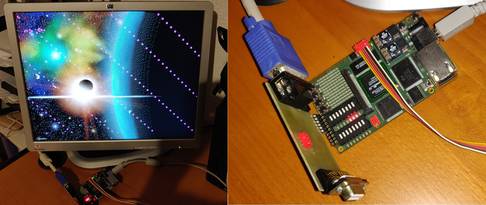
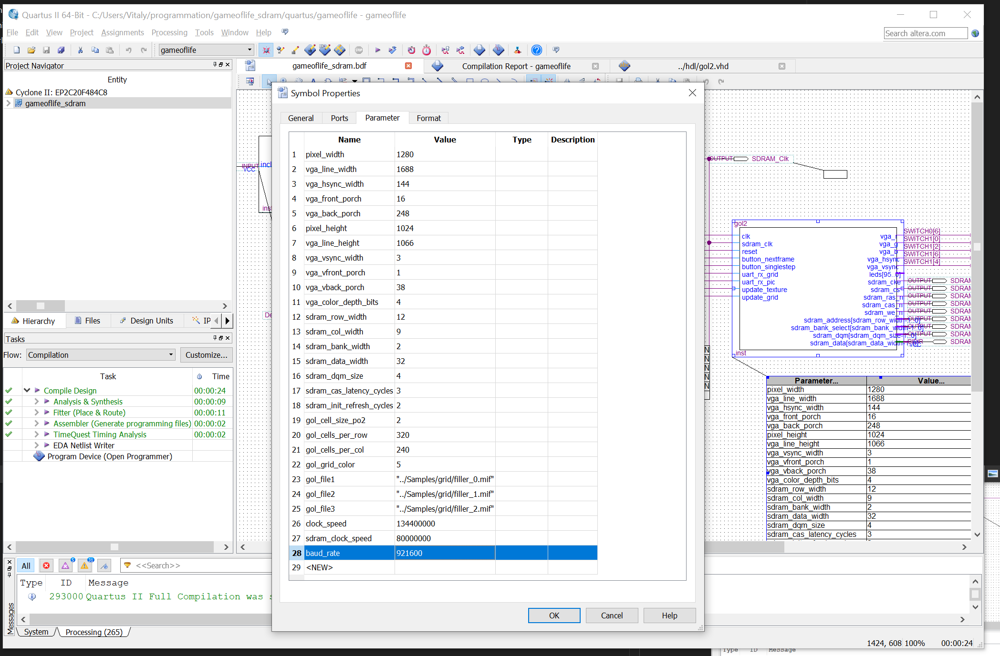

======================
Game of Life on FPGA4U
======================

In this project, we implement the game of life on the `FPGA4U
<http://fpga4u.epfl.ch>`__. The final result features a high-resolution VGA
controller, an RS232 UART, and an SDRAM controller. It allows uploading game of
life patterns and eight-color high resolution images. It is possible to run the
game step by step or in continuous mode. The VHDL design is entirely
configurable: baud rate, VGA resolution, and grid size are customizable. The
project uses two different PLLs for the VGA controller and the SDRAM to allow
high screen refresh rates without being limited by the SDRAM speed.

This project was originally done in spring semester 2007 at the Logic Systems
Laboratory, EPFL (Lausanne) under the supervision of Prof. Eduardo Sanchez.

Setup instructions
==================

This readme explains how to build and run the project. For more details about
the design and implementation, please go `here <Documentation/README.rst>`__.

1. Download and install Quartus II WebEdition v13.0sp1 with Cyclone II
   support. Note that more recent versions do not support Cyclone II anymore.

2. Install the Quartus programming driver. This is required in order to flash the
   bitstream on the development board. You should find the driver in
   ``C:\altera\13.0sp1\quartus\drivers\usb-blaster-ii``.

3. Open the ``gameoflife.qpf`` project file. You should see something like this:

    .. image:: Documentation/images/quartus1.png

4. Build the project (Processing / Start Compilation). At the end of the
   process, you should see the following summary:

    .. image:: Documentation/images/quartus2.png

5. Connect the board via USB and open the programmer (Tools / Programmer).
   Select the ``USB Blaster`` and click ``Start``.

    .. image:: Documentation/images/quartus3.png

6. Connect the VGA extension board to the output pins of the board as shown on the
   photo at the beginning of this tutorial. You can use any similar board as
   long as it has 3 pins for color input, 1 for vertical retrace, and 1 for
   horizontal retrace. You can see the pin assignments in the main ``bdf`` file
   above.

Customizing design parameters
=============================

You may customize the screen resolution, the serial port speed, as well as the
pre-defined grid pattern by modifying the following settings. By default,
they assume a 1280x1024 resolution and a 921600 baud rate. The VGA controller
runs at 134MHz while the SDRAM runs at 80MHz.

.. warning::

    If you change clock frequencies here, please also change the PLL settings
    in the ``bdf`` file (see the ``pll1`` and ``sdram_pll`` in the screenshot above).

Uploading background images
===========================

When the design is loaded, the screen is initialized with a blue-black pattern.
You can upload the background picture through the RS232 connector.

1. Install Visual Studio 2019 and build the ``Utilities.sln`` project.
   You will need C# and C++ support.

2. Connect an RS232 module to the board. You may use any module you want, e.g.,
   a MAX232 chip. Note that by default, the design is compiled assuming a
   921600 bps rate. Some USB-to-serial adapters, such as the Prolific PL2303
   support high rates. If this is too high, reduce it by modifying the
   corresponding parameter and rebuild the project.

4. Put the board into image upload mode.
   All the switches on the board must be in the ``0`` position.

5. Choose a bitmap image (jpeg, bmp, png...) and convert it to a bitstream file
   that is understood by the design.

   .. code-block:: bash

        cd C:\Users\demo\gameoflife\Samples\background
        ..\..\Utilities\Release\BitmapConverter.exe bin space.jpg 4 space.bin
        ..\..\Utilities\Release\Serial.exe 921600 space.bin \\.\com3

Uploading grid files
====================

You will find a few sample grids in the ``Samples\grid`` folder.
A grid is a black-and-white 320x240 image. This image can be either generated
from a ``.life`` file or hand-drawn. Then, the bitmap is converted to a binary
file suitable for upload to the board.

1. Convert a ``.life`` file to a bitmap.

   .. code-block:: bash

        ..\..\Utilities\Release\net40\Grid2Bmp.exe 320 240 filler.life filler.bmp

2. Convert the bitmap to a binary

   .. code-block:: bash

        ..\..\Utilities\Release\BitmapConverter.exe bin filler.bmp 1 filler.bin

3. Put the board in grid upload mode. If you use the FPGA4U, enable switches 5 and 1
   on ``SW2``. More information on the board layout and switch position can be found
   `here <https://fpga4u.epfl.ch/wiki/FPGA4U_Description.html#Switches>`__.

4. Upload the grid.

   .. code-block:: bash

        ..\..\Utilities\Release\Serial.exe 921600 filler.bin \\.\com3

5. Disable grid upload mode (switch 5), disable single step mode (switch 1), and
   resume the game (push button ``SW3``).
